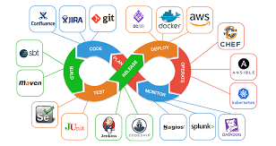
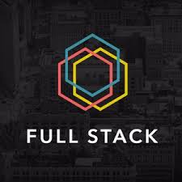
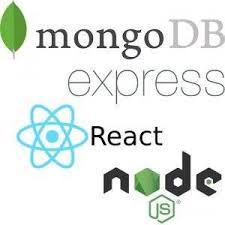

## Hi there 👋 John here! Loves developing..
#### Welcome to *JohnS-coders* Github 🔭
####
#### I am **DevOps** and **FullStack** :technologist:
I work on the Languages you will see in my repos.
But I'm interested in **React-Native** and **React especially**.
<!--
  |  |  

-->

  

- 🔭 I’m currently working on some personal projects.
- 👯 I’m looking forward to collaborate on open source projects

## 🛠 Skills: 

-HTML5 
-Css3 
-Python 
-JavaScript 
-React Native 
-React 
-Django 
-NodeJs 
-MongoDB 
-SQL,PostgreSQL

## 📫 How to reach me:  

 

- 💬 If you require any further information, please feel free to contact me.

<!--
**JohnS-coder/JohnS-coder** is a ✨ _special_ ✨ repository because its `README.md` (this file) appears on your GitHub profile.

Here are some ideas to get you started:

- 🔭 I’m currently working on ...
- 🌱 I’m currently learning ...
- 👯 I’m looking to collaborate on ...
- 🤔 I’m looking for help with ...
- 💬 Ask me about ...
- 📫 How to reach me: ...
- 😄 Pronouns: ...
- ⚡ Fun fact: ...
-->
